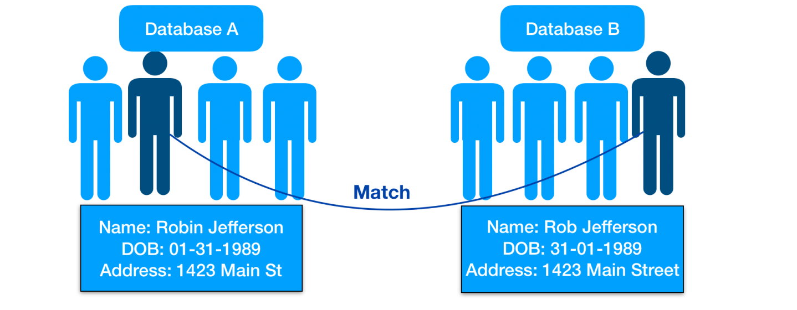
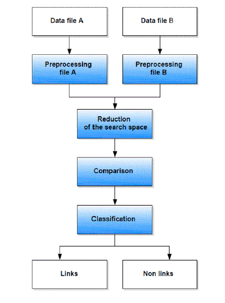
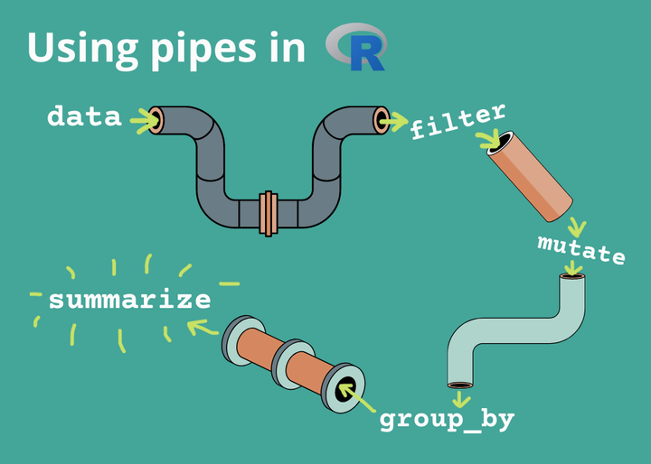
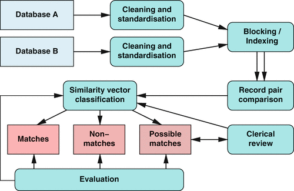

```{r echo=FALSE, message=FALSE, warning=FALSE}
options(htmltools.dir.version = FALSE)
knitr::opts_chunk$set(
  warning = FALSE,
  message = FALSE,
  fig.showtext = TRUE
)
library(tidyverse)
library(unhcrthemes)
library(fontawesome)
# install.packages("RecordLinkage")
# library(RecordLinkage)
# install.packages("fastLink")
library(fastLink) 
```


```{r include=FALSE}
data <- readxl::read_excel(here::here("data-raw", "Registros2.xlsx"),
    sheet = "Sheet1") |> janitor::clean_names()
#names(data)
```

##  Introduction

Imagine you need to lnk your registration database with a list of beneficiaries created by a partner....

> Record linkage (_also called de-duplication or Entity resolution_) is the process of joining multiple data sets removes duplicate entities often in the absence of a unique identifier.

Needed for instance, when reconciling multiple registration list to build a single sampling universe when preparing for a survey in the absence of a common registration database...

Exact matching is a method that says two records are a match if they agree on every feature. Exact matching ONLY works well if the linking data are perfect and present in all the databases you want to link works best when there is a single unique identifier (key/uuid). 

Performing exact matching is often not do-able when reconciling registration list with individual data coming from different partners as many issues can arise when trying to match only on names.  In such cases Matching that allows fields to __only be similar__ rather than exact duplicates will likely be more robust.

---

## Challenges with individuals matching 


.pull-left[  

What needs to be fixed... 

* Spelling of names and first names can be different

* Occurrence of special characters and space

* Usage of multiple names compounded together (father name + mother name)

* Usage of data of Birth Vs Age..

* not the same exact data available on each list

* multiple lists to merge together (more than 2!)

]
.pull-right[

]

 
---

##  Workflow


.pull-left[  

The recommended workflow includes to go through specific steps:

 * Data Pre-processing
 
 * Identify blocking variables: Reduction of search space: Blocking

 * Perform Comparison
 
 * Review results based on acceptation threshold

]
.pull-right[

]

???
To minimize the number of computation, it is important to perform Record linkage only within the blocks, i.e. to block partitions similar records into bins or blocks.


---

## Pre-processing: Cleaning & Harmonisation

.pull-left[  

Keep only people with phone number

Common fields in the data to be identified and harmonized (Clean Gender or Nationality...) 


]
.pull-right[ 

```
data.prep <- data |>
  
  ## Filter when phone number is not available  
  dplyr::filter( telefono != "NO REFIERE") |>
  
  ## Clean the gender variable
  # data |> dplyr::select(genero) |> 
  # dplyr::distinct() |> dplyr::pull()
  
  dplyr::mutate(gender = dplyr::case_when(
    genero %in% c("F" ,"FEMENINO" ,
                   "f",  "Femenino") ~ "F",
                   
    genero %in% c("M" , "MASCULINO" , 
                   "Masculino") ~ "M",
                   
    genero %in% c("X",  "Otro") ~ "Ot",
    TRUE ~  NA  ))  
    
    
```
]


---

## Pre-processing: String  

.pull-left[  

String treatment

* Remove Punctuation

* Convert to Upper Case

* Address special characters and encoding
]
.pull-right[ 

```
  #  Convert to uppercase
  names_column_new <- toupper(names_column)
  
  # Remove punctuation, digits, and all spaces
  names_column_new <- gsub(
      "[[:punct:][:digit:]][[:space:]]", 
      "", 
      names_column_new)

  # Convert special char to ASCII equivalents
  names_column_new <- iconv(
             names_column_new, 
             "latin1", 
             "ASCII//TRANSLIT",
              sub = "")
  
  # Keep only alphabetic characters
  names_column_new <- gsub(
            "[^[:alpha:]]",
            "",
            names_column_new)
```
]

---

## Pre-processing: Common words & Stop words

.pull-left[  

 Remove user defined list of common words.

 Common words within names like  __"JR", " SR", " IV", " III", " II"__ may prevent good matching and can be removed.
 
 Needs to be contextualized to the cultural context.
]
.pull-right[ 

```
## Define list of words to remove
toRemove = c(" JR", " SR", 
                " IV", " III", " II")
                
# Remove specified name suffixes
for (tR in toRemove) {
    names_column_new <- gsub(
          tR, 
          "", 
          names_column_new)
  }
  
```
]

---

## Pre-processing: Date

.pull-left[  


Turn Date of Birth to Year-Month and Age

Turn Age to Age Cohort

]
.pull-right[ 

```
data.prep <- data |>
  
dplyr::mutate(
  DateOfBirth = lubridate::as_date(DoB),
  
  dob_day = as.numeric(
      lubridate::day(DateOfBirth)),
  
  dob_month = as.numeric(
      lubridate::month(DateOfBirth)),
  
  dob_year = as.numeric(year(
      lubridate::year(DateOfBirth)),
      
  age = today()-     
  
  age_cohort = dplyr::case_when(
    genero %in% c("F" ,"FEMENINO" ,
                   "f",  "Femenino") ~ "F",
                   
    genero %in% c("M" , "MASCULINO" , 
                   "Masculino") ~ "M",
                   
    genero %in% c("X",  "Otro") ~ "Ot",
    TRUE ~  NA  )   )
    
```
]


---

## Pre-processing: Separate name 


.pull-left[  

Use the name pattern to separate the name

 in case family name is more than one word, 

identify family prefix to bind with  such as "DEL", 'DE", "DE LOS", "DE LAS"
]
.pull-right[ 

```


```
]


 

---

## Pipe the treatment


.pull-left[ 

Each steps described above to be:

 * organised within functions
 
 * piped using the tidyverse approach
 
 [Revise this presentation notebook to use the functions]()
 
 ]
.pull-right[ 


]
 

```{r function-separate_fullname, include=FALSE}
#' separate_name
#' 
#' use the name pattern to separate the name
#' in case family name is more than one word, 
#'  identify family prefix to bind with  such as "DEL", 'DE", "DE LOS", "DE LAS"
#' @param fullname full name including everything together
#' @param namepattern either "firstname_fathername_mother_name" or "fathername_mothername_firstname
#' @return a list with c("firstname","fathername","mothername")
#' 
#' @export
separate_fullname <- function(fullname, namepattern){
    
  # ### 
  # sp <- tidyr::separate(fullname, " ")
  # 
  # return(sp)
}

test <- data |> 
        dplyr::filter(  is.na(nombres) ) |> 
        dplyr::select(nombre_completo, name_pattern)  

fullname <- test$nombre_completo
namepattern <- test$name_pattern
sep <- separate_fullname(fullname, namepattern)

# data |> dplyr::select(  name_pattern) |> dplyr::distinct() |> dplyr::pull()

```
 
 
    
```{r function-cleanvar, include=FALSE}
#' cleanvar
#' 
#' function for data cleaning with additional name removal logic
#' 
#' @param names_column name of the column to treat
#' @param  toRemove  default vector with stuff to remove from name
#'                    c(" JR", " SR", " IV", " III", " II")
#' @return  names_column_new name of the column treat
#' 
#' @export
cleanvar <- function(names_column,
                      toRemove = c(" JR", " SR", " IV", " III", " II")) {
  #  Convert to uppercase
  names_column_new <- toupper(names_column)
  # Remove specified name suffixes
  for (tR in toRemove) {
    names_column_new <- gsub(tR, "", names_column_new)
  }
  # Convert special characters to ASCII equivalents
  names_column_new <- iconv(names_column_new, "latin1", "ASCII//TRANSLIT", sub = "")
  # Remove punctuation, digits, and all spaces
  names_column_new <- gsub("[[:punct:][:digit:]][[:space:]]", "", names_column_new)
  # Create a new variable with only alphabetic characters
  names_column_new <- gsub("[^[:alpha:]]", "", names_column_new)
  
  return(names_column_new)
}

```


  
```{r example-cleanvar, include=FALSE}
## Filter the right nationality
data.prep <- data |>
  
  ## Filter where the phone number is not available -- "NO REFIERE"
  dplyr::filter( telefono != "NO REFIERE") |>
  
  ## Clean age_range
  # dplyr::mutate( age_range = dplyr::case_when(
  #   !(is.null(edad)) & (edad <5 ) ~ "0-4",
  #   genero %in% c("M" , "MASCULINO" , "Masculino") ~ "M",
  #   genero %in% c("X",  "Otro") ~ "Ot",
  #   TRUE ~  age_range  )) |>
  
  ## Clean the gender variable
  # data |> dplyr::select(genero) |> dplyr::distinct() |> dplyr::pull()
  dplyr::mutate(gender = dplyr::case_when(
    genero %in% c("F" ,"FEMENINO" ,"f",  "Femenino") ~ "F",
    genero %in% c("M" , "MASCULINO" , "Masculino") ~ "M",
    genero %in% c("X",  "Otro") ~ "Ot",
    TRUE ~  NA  )) |>
  
  ## Only retain the nationality of interest
  # data |> dplyr::select(nacionalidad) |> dplyr::distinct() |> dplyr::pull()
  dplyr::mutate(nationality = dplyr::case_when(
    nacionalidad %in% c("Venzuela", "venezuela",  "Venezolana", 
                                     "VENEZUELA",
                                     "Venezuela", "VENEZOLANO", "VENEZOLANA") ~ "VEN",
    nacionalidad %in% c("COLOMBIANO", "COLOMBIANA", "COLOMBIA",
                                    "colombia", "Colombia", "Nac. Colombia",
                                    "Colombiana" ) ~ "COL",
    TRUE ~ "other"  )) |>
  dplyr::filter( nationality %in% c("VEN", "COL" ))
```


```{r example-cleanvar2, include=FALSE}
data.prep <- data.prep |>
  ## Apply cleanvar()
  # Perform data cleaning on dfA using the clean_names function
  dplyr::mutate_at( dplyr::vars(nombres, apellido_paterno, apellido_materno,
                                asistencia, departamento, telefono,
                                planilla, socio), 
                   list(new = cleanvar))  |>
  
  
  ### identify single data source
  dplyr::mutate(datasource = paste0(socio_new, "_", planilla_new)) |>
  
  # ## Retain only fields for record linkage
  dplyr::select(datasource, nationality, nombres_new, apellido_paterno_new,
                   apellido_materno_new, asistencia_new, departamento_new,
                   telefono_new, gender)
  
# table(data.prep$gender, useNA = "ifany") 
# table(data.prep$nationality, useNA = "ifany") 
# table(data.prep$datasource, useNA = "ifany")
# ## See if can use departamento for blocking
# table(data.prep$datasource, data.prep$departamento_new, useNA = "ifany")
#dput(names(data.prep)) 
```
  
 

---

## Reduction of search space: Blocking

To minimize the number of computation, it is important to perform Record linkage only within the blocks, i.e. __to partition similar records into bins__
 
A deterministic partition can be formed based upon the data. This imply to choose the blocking features (variables or keys) containing the fewest errors or missing values should be chosen as blocking variables. A partition is then created by treating certain fields that are thought to be nearly error-free as fixed, 

> for instance a Partition of date of birth year or age range. 

An alternative is to use multiple keys to consider typographical or measurement errors that would exclude true matches. For instance, Blocking by last name initial or zip code. This produces overlapping blocks of the data: records match on field A or field B
 

---

## Comparison: String Matching

Deterministic, i.e Automatic comparisons where either everything needs to match, or specific data specific rules are programmed. Though this Needs new rule for every variation in data, which therefore can not be generalizable to other datasets

 * Levenshtein distance is the minimum number of substitutions required to transform one string into another.
 
 * The Jaro distance considers common characters and character transpositions. 
 
 *  The Soundex algorithm generates a code representing the phonetic pronunciation of a word. This is typicall more useful on non-English names or longer names. The Soundex code for a name consists of a letter followed by three numerical digits.

---

## Compare linkage with {fastlink}


``` 
matches.out <- fastLink::fastLink(
             dfA = dfA, 
             dfB = dfB, 
                 
         # Specify the vector of variable names to be used for matching.
         # These variable names should exist in both dfA and dfB
         varnames = c('FN', 'LN', 'dob_day', 'dob_month', 'dob_year'),
        
        # Specify which variables among varnames should be compared using string distance
        stringdist.match = c('FN', 'LN'),
        
        # Specify which variables present in  stringdist.match can be partially matched
        partial.match = c('FN', 'LN'),
        
        # Specify which variables should be matched numerically
        # Must be a subset of 'varnames' and must not be present in 'stringdist.match'.
        numeric.match = c('dob_day', 'dob_month', 'dob_year'),
        
        # Specify the number of CPU cores to utilize (parallel processing). 
        ## Get the number of detected cores minus 1,  Reserve one core for 
        #non-computational tasks to help prevent system slowdowns or unresponsiveness
        n.cores = parallel::detectCores() - 1,
        return.df = TRUE)
```
???
The default threshold for matches is 0.94 (threshold.match =) but you can adjust it higher or lower. If you define the threshold, consider that higher thresholds could yield more false-negatives (rows that do not match which actually should match) and likewise a lower threshold could yield more false-positive matches.

---

## Evaluate results


.pull-left[ 

Last stage involves a manual __clerical review__ of the results, specifically the  __Possible Matches__
 
 ]
.pull-right[ 


]

---

## Evaluation metrics
 

> The posterior probability refers to the  updated probability of an event occurring given some observed data using Bayesian inference. It represents the "strength of the matches"  and is a combination of the initial belief and the new evidence. 

List of parameter estimates for different fields:

 *  __patterns.w__: Counts of the agreement patterns observed (2 = match, 1 = partial match, 0 = non-match), along with the Felligi-Sunter Weights.

 *  __iter.converge__: The number of iterations it took the EM algorithm to converge.

 *  __zeta.j__: The posterior match probabilities for each unique pattern.

 *  __p.m__ & __p.u__ : The posterior probability of a pair matching (m) & pair not matching (u).

 *  __p.gamma.k.m__ & __p.gamma.k.u__: The posterior of the matching probability (m) & non-matching probability (u) for a specific matching field.

 *  __p.gamma.j.m__ & __p.gamma.j.u__: The posterior probability that a pair is in the matched set (m) or in the unmatched set (u)  given a particular agreement pattern.


???
 *  __nobs.a__: The number of observations in dataset A.

 *  __nobs.b__: The number of observations in dataset B.

---

##  Function to get the metrics


```
# Confusion Matrice
fastLink::confusion(matches.out, threshold = 0.98)

# Examine the EM object:
matches.out$EM

# Summarize the accuracy of the match:
# each column gives the match count, match rate,
# false discovery rate (FDR) and false negative rate (FNR)
# under different cutoffs for matches based on the posterior 
# probability of a match. 
summary(matches.out)

## Get the output...
matched_dfs <- fastLink::getMatches(
                      dfA = dfA, 
                      dfB = dfB, 
                      fl.out = matches.out, 
                      threshold.match = 0.85
)


```

---

## Join based on the probabilistic matches

 
```
# convert cases rownames to a column 
cases_clean <- cases %>% rownames_to_column()

# convert test_results rownames to a column
results_clean <- results %>% rownames_to_column()  

# convert all columns in matches dataset to character, 
#so they can be joined to the rownames
matches_clean <- my_matches %>%
  mutate(across(everything(), as.character))


# Join matches to dfA, then add dfB
# column "inds.b" is added to dfA
complete <- left_join(cases_clean, matches_clean, by = c("rowname" = "inds.a"))

# column(s) from dfB are added 
complete <- left_join(complete, results_clean, by = c("inds.b" = "rowname"))
```

---

## Iterate over multiple sources comparionsr

Often, we run several different matches for a single data set - for instance when there are multiple list or blocking options

```
#Preprocessing Matches via Blocking
blockgender_out <- blockData(dfA, dfB, varnames = "gender")

## Subset dfA into blocks
dfA_block1 <- dfA[blockgender_out$block.1$dfA.inds,]
dfA_block2 <- dfA[blockgender_out$block.2$dfA.inds,]

## Subset dfB into blocks
dfB_block1 <- dfB[blockgender_out$block.1$dfB.inds,]
dfB_block2 <- dfB[blockgender_out$block.2$dfB.inds,]

```

---

## Aggregating Multiple Matches Together

 
```
## Run fastLink on each
link.1 <- fastLink(
  dfA_block1, dfB_block1,
  varnames = c("firstname", "lastname", "housenum",
               "streetname", "city", "birthyear")
) 

link.2 <- fastLink(
  dfA_block2, dfB_block2,
  varnames = c("firstname", "lastname", "housenum",
               "streetname", "city", "birthyear")
)

## aggregate multiple matches into a single summary with aggregateEM() 
agg.out <- aggregateEM(em.list = list(link.1, link.2))
```

---

## Questions

Please [post here your questions](https://github.com/unhcr-americas/record_linkage/issues/new)

## Reference: 


[Fastlink Documentation](https://github.com/kosukeimai/fastLink)

[Presentation from UN Stat Commission](https://www.youtube.com/watch?v=S7boX8X4uXU) - a practical example from DANE in Colombia - matching a survey - - Gran encuesta integrada de hogares (GEIH) - with a registry - Registro Estadístico de Relaciones Laborales (RELAB) - 

[A tutorial on Probabilistic matching from The Epidemiologist R Handbook](https://epirhandbook.com/en/joining-data.html#probabalistic-matching)

[Using a Probabilistic Model to Assist Merging of Large-scale Administrative Records](http://imai.fas.harvard.edu/research/linkage.html)

